# Information for Contributors

## PR management
To fulfill automotive industry requirements, CI of this repo requires many enterprise toolings which are not available on github. PRs from github will be synced to BMW internal github to run CI.
The PR may be edited by maintainer to fulfill the code quality and compatibility requirements. **But the maintainers promise to keep the author of the commits**.

## Repository Structure
The repository is structured into three main parts:
- The Compiler which generates an ELF-like executable artifact from an input WebAssembly module
- The Runtime which can execute the artifact the Compiler produces
- Utils that can be used to simplify setting up signal handlers and allocate executable memory

### Compiler
The compiler takes a WebAssembly module as an input and generates an ELF-like executable binary. Similarly to the modular structure of LLVM, it is split into multiple parts:
- Frontend: Parses the WebAssembly bytecode, generates a transient stack-based intermediate representation (IR) and triggers code emission in the backend. This portion is agnostic to the compilation target.
- Backend: Handles the actual emission of machine code and consumes the transient stack-based IR the Frontend produces. It further contains the full encoding of the machine code for a specific ISA and contains an Assembler class which handles low-level code generation.
- Common: ISA-independent helper functions that are used by both the Frontend and Backend.

### Runtime
The Runtime can be used to instantiate the artifact produced by the Compiler, link corresponding host functions (if they are dynamically linked), retrieve a reference to functions and globals that are exported from the WebAssembly module and mediates access to Linear Memory from outside.

### Utils
The utils that are shipped with WARP provide helper classes for integrators like ExecutableMemory which simplifies the allocation of executable memory (the output of the compiler needs to be put into a region of explicitly executable memory so that Runtime can execute the logic contained in the binary) or SignalFunctionWrapper which sets up signal handlers that are needed if MMU-protection is enabled. (Highly recommended due to performance reasons on non-embedded systems).

## Code Emission
The general approach for emission of machine code this compiler relies on is based on Valent Blocks. The basic concept splits WebAssembly instructions in two categories:
- Instructions which have non-stack side-effects. This is any instruction that can trap (includes linear memory access instructions), change the control flow or writes to globals or locals.
- Instructions that only affect the stack like non-trapping arithmetics.

Once the Frontend parses a WebAssembly instruction and the instruction is not associated with non-stack side-effects, it is simply recorded on a temporary IR stack. If the instruction does indeed exhibit non-stack side-effects (like br_if or local.set), then all recorded instructions which are inherently organized into nested Valent Blocks[^1] that are currently on the compile-time stack are _condensed_[^2] from the top of the stack until all inputs for the instruction are available as single-elements.

[^1]: A Valent Block describes a sequence of instructions that, if it were executed when it was encountered, represents a single value on the evaluated stack.
[^2]: `Condensation` of blocks describes the process of emitting machine code for a sequence of instructions so that the result of a sequence of instructions can be described by single element, e.g. a storage location like a slot on the runtime-stack or a CPU register.

## Runtime Memory Layout

The basic layout of the memory a module uses consists of a basedata section and the WebAssembly module's linear memory. The basedata section is where global variables are stored, function pointers for dynamically linked host functions are kept and other information for bookkeeping is stored, like the current size of the linear memory. The basedata section is positioned right in front of the start of the linear memory.

```mermaid
block-beta
    runtime["Basedata"]:1
    linmem["Linear Memory →"]:3
```

## Linear Memory and Stack Overflow Protection

The compiler and runtime supports two approaches for sandboxing accesses to the WebAssembly module's linear memory. The following descriptions are valid for stack overflow protection in a similar fashion and will not be described in detail. The maximum checked address is recorded. This approach has the advantage that the maximum accessed address (so the actual memory usage) can be inspected by the integrator with byte-resolution.

This approach supports lazy allocation. The integrator provides a memory-function (quasi an allocation adapter) that decides by how much to grow the allocation, or whether to allocate the full memory at once.

### Active (explicit) Bounds Checks
Active bounds check means there are actual instructions generated before performing a (load or store) linear memory access. This has a significant impact on performance, but is required under certain circumstances, e.g. on embedded systems that do not have a memory management unit (MMU).

### Passive (implicit) Bounds Checks
Passive bounds checks are more efficient and delegate the bounds-checking mechanism to the system's MMU. The maximum size of a WebAssembly module's linear memory is 4GB (32-bit address space), but it has to be kept in mind that the theoretical maximum addressable position is defined by the sum of a 32-bit unsigned address plus a 32-bit unsigned offset (so 8GB). To enforce linear memory bounds, the compiler takes care to emit instructions that guarantee that the addressed region lies within those 8GB of the start of the linear memory.

Additionally, the full 8GB addressable space is pre-allocated as virtual memory (not physical memory!) and only the pages that should be accessible according to the *formal* size of the WebAssembly module's memory are marked as read/write-accessible and all pages after are marked as protected/non-accessible.

In addition, a signal handler is set up so any accesses that are out of bounds (targeting a virtually allocated memory page that is not accessible) can be caught and do not lead to a SIGSEGV that will abort the whole process, but can rather be re-routed to throw a C++ exception that can be gracefully handled by the integrator.

A corresponding utility class called `SignalFunctionWrapper` is provided that allows to set up a signal handler accordingly for catching signals triggered by out of bounds memory accesses and stack overflows.

If this mode is enabled, there are two additional modes for allocation that can be configured at compile-time of the compiler executable via `EAGER_ALLOCATION` (See [docs/GettingStarted.md](docs/GettingStarted.md))

## Linking Host Functions

The Compiler and Runtime need to allow the WebAssembly modules to call host (C++) functions that are imported from the host environment (and explicitly provided by the integrator). There are two ways those host functions can be linked to a WebAssembly module:

### Dynamic Linking
In this case the actual address of the function is only provided when initializing the WebAssembly module via the Runtime class. During compilation only the corresponding function signature is required. The Compiler will then produce code that loads the address to call from a reserved region in the module's memory (before the start of linear memory).

### Static Linking
When host functions are statically linked to the module, their address needs to be provided to the Compiler and is *hard-coded* the machine code. Function calling then requires less memory accesses (since the function address doesn't need to be looked up first) and the module requires less runtime memory (since the function pointers are not kept explicitly in memory)

*NOTE*: On systems that use ASLR (Address Space Layout Randomization), a module has to be either compiled every time the process is started or the dynamic linking approach has to be used. This is due to the fact that on those systems, absolute function addresses change every time the program is started.

## Instruction Naming Convention
The instructions that correspond to the target ISA are defined in the `src/core/compiler/backend/xxx_encoding.hpp` files. The following section describes the convention that is used to name the instructions. 

- The name of the definition shall start with an the uppercase mnemonic, e.g. the AArch64 instruction `ADD <Wd|WSP>, <Wn|WSP>, <Wm>{, <extend> {#<amount>}}` is written as ` ADD_wD_wN_imm12zxols12`.
- The mnemonic and all arguments to the instruction are separated by underscores.
- Register arguments shall be written according to the official definition while ensuring easy readability.
- Immediates shall be called `immXX`, `relXX` or `constXX`, depending on the official description, where XX describes the bits that can be encoded.
    - If the immediate is zero- or sign-extended, it shall have the suffix `zx` and `sx`, respectively.
    - Immediates that are left-shifted (multiplied by a power of 2) by a fixed number of bits shall further have the suffix `lsXX` (left shift by XX bits).
    - If a shift of an immediate is optional, it should include the letter `o`, e.g. `ols12` (optional left shift by 12 bits).
    - Immediates that are left shifted by a variable number of bits, it shall be called `olsImm6` (optional left shift by a 6-bit immediate) for example.
- All setters and getters for instruction arguments that are used to encode the actual final instruction shall use the exact same naming conventions in camelCase using a `set` or `get` prefix, e.g. `setOlsImm6` to set a field called `olsImm6`.
- (A sequence of) arguments to an instruction that describe a memory location shall be prefixed by `deref` (dereferenced), e.g. `LDR_wT_deref_xN_xM_t` (Load word-size register T from/by dereferencing the memory location described by 64-bit address register N plus 64-bit index register M)
- OPCodeTemplates shall have the suffix `_t`, whereas full `AbstrInstr` descriptions of instructions shall use the same name without this suffix.
- If an argument can be either a memory location or a register (like on x86_64), it shall be called `rm` (register/memory) while registers on x86_64 just have the `r` prefix.
