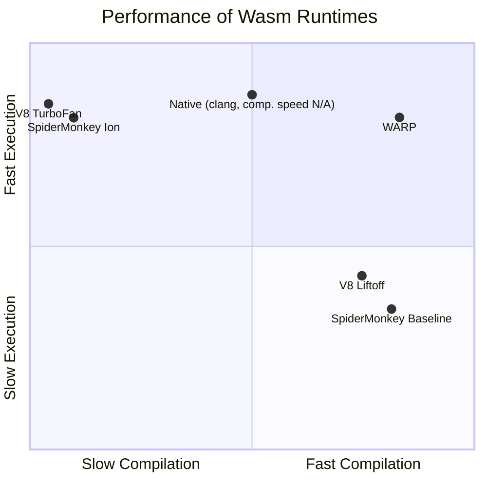

# WARP WebAssembly Compiler

**_WebAssembly Resource-Efficient Processor:_** **A WebAssembly Compiler and Runtime based on the Valent Block approach**

## Special Thanks

This project was originally created by [Fabian Scheidl](https://github.com/fscheidl), based on his research and the paper (see [Citation](#citation)).
---

[Getting Started using WARP](docs/GettingStarted.md) | [Information for Contributors](docs/InfoForContributors.md)

WARP is a lightweight and blazingly fast WebAssembly (Wasm) compiler and runtime library designed for use on resource-constrained embedded systems while seamlessly scaling to high-powered desktop and server systems. WARP is designed to be as portable as possible, written in C++14, works even on bare-metal systems and has only minimal dependencies on specific features provided by operating systems and other libraries.

It features a compiler, assembler and runtime that were designed from ground up for embedded systems with the goal to be as resource-efficient during compilation as well as during execution. The compiler takes WebAssembly (binary) bytecode (`.wasm`) as an input and produces an artifact similar to an ELF file that can be instantiated and executed using the corresponding runtime.

## Features

- Industry leading compilation speed and close to native execution speed
  - Highly efficient singlepass compilation
- Low resource consumption
  - Low RAM usage during compilation
  - Small binary size
- Strict sandboxing: WebAssembly modules only get access to resources that are explicitly allowed
- Seamless integration into C++ source code with intuitive calling mechanisms and minimal boilerplate code
- Support for re-instantiating modules that were compiled ahead of time using the WARP Compiler
  - Choice of dynamic or static linking of host functions that are imported into the WebAssembly module
- Zero internal dynamic memory allocation within the library, can even use statically allocated regions of memory
- Apart from the input Wasm bytecode, the library utilizes only two contiguous memory regions the integrator has full control over
  - Compiler memory and output memory
- Choice of explicit bounds checks for memory accesses or delegation to the MMU on Windows and POSIX systems via signal handlers for super fast execution[^1]
- Choice of explicit stack overflow check or delegation of such to the OS [^1]
- Support for bare metal, Unix, macOS, QNX and Windows systems based on AArch64, x86_64 or TriCore v1.8+
- Support for WebAssembly MVP (Version 1.0) with additional features from WebAssembly Version 2.0
- Adherence to the AUTOSAR C++14 Guidelines and MISRA C++
  - No recursions
- Support for builds via CMake and Bazel
- Builtin functions that allow efficient and seamless read-only access to host memory if explicitly provided
- Support for interrupting WebAssembly modules from a separate thread
- Support for printing stacktraces on traps
- Support for attaching a debugger to single-step WebAssembly modules
- Support for cross-compilation

[^1]: Not supported on TriCore

### Supported WebAssembly Features and Limitations

| Functionality                         | Supported | Limitation                              |
| ------------------------------------- | --------- | --------------------------------------- |
| MVP Features                          | Yes       | No imported globals, tables or memories |
| Exported Mutable Globals              | Yes       | None                                    |
| Sign Extension Instructions           | Yes       | None                                    |
| Non-trapping float-to-int conversions | No        | -                                       |

## Supported instruction sets

The following variants/instruction sets are currently supported:

| Flag    | Architecture   | Status          |
| ------- | -------------- | --------------- |
| x86_64  | 64-bit x86     | finished        |
| aarch64 | 64-bit ARM     | finished        |
| tricore | 32-bit TriCore | finished        |
| aarch32 | 32-bit ARM     | not implemented |

## Performance

### Compilation and Execution Speed

[see Benchmark guide](./scripts/benchmark/Readme.md)



### Binary Size

For demonstration purposes, the benchmark executable `vb_bench` is referred to here. On a stripped release build `-O3` compiled with Clang 17 for macOS (AArch64 target), the executable has a size of only 187 kB, including Compiler, Assembler and Runtime.

### RAM Usage

Tested with analytics `scripts/run_analysis.py` during compilation of an exemplary benchmark WebAssembly usecase module from the wasm-compiler-benchmarks repo using the AArch64 variant with MMU support enabled. This benchmark did not measure the stack needed by the compiler. Due to the highly efficient and compressed nature of WebAssembly, the output machine code is inevitably larger than the input WebAssembly module.

| Architecture  | Input Bytecode | Output Machine Code | Extra Compiler Heap Memory | Out/In Ratio |
| ------------- | -------------- | ------------------- | -------------------------- | ------------ |
| AArch64       | 170103 bytes   | 488628 bytes        | 10496 bytes                | 2.87         |
| x86_64        | 170103 bytes   | 385524 bytes        | 10368 bytes                | 2.27         |
| TriCore v1.8+ | 170103 bytes   | 847096 bytes        | 10368 bytes                | 4.98[^2]     |

[^2]: Without MMU support, needs explicit software bounds checks for memory accesses

## Third-Party Dependencies

In production code (so not counting spec- and unittests), the AArch64 and x86_64 variants do not have any dependencies on external libraries. The TriCore backend has a dependency on the [berkeley-softfloat-3](https://github.com/ucb-bar/berkeley-softfloat-3) library.

## Citation
```
@INPROCEEDINGS{9231154,
  author={Scheidl, Fabian},
  booktitle={2020 International Conference on Computing, Electronics & Communications Engineering (iCCECE)}, 
  title={Valent-Blocks: Scalable High-Performance Compilation of WebAssembly Bytecode For Embedded Systems}, 
  year={2020},
  volume={},
  number={},
  pages={119-124},
  keywords={Registers;Runtime;Embedded systems;Optimization;Software;Instruction sets;Virtualization;retargetable compiler;internet of things;safety;sandbox;fault isolation;virtual machine;runtime;webassembly;performance;embedded;energy consumption;memory;resource constrained;sensor nodes},
  doi={10.1109/iCCECE49321.2020.9231154}}
```
